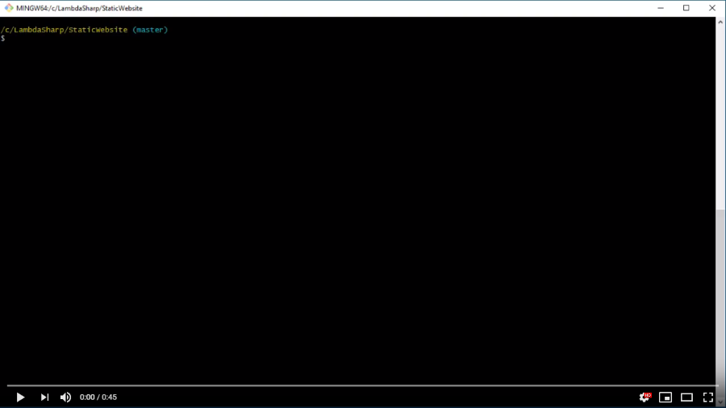

# λ# - Create a Static Website with CloudFormation

[This sample requires the λ# tool to deploy.](https://github.com/LambdaSharp/LambdaSharpTool)

## Overview

This λ# module creates a static website hosted by an S3 bucket with a customizable title and greeting message. The assets for the website are uploaded from the `wwwroot` folder and copied to the S3 bucket during deployment.

## Deploy

This module is compiled to CloudFormation and deployed using the λ# CLI.

```
git clone https://github.com/LambdaSharp/StaticWebsite-Sample.git
cd StaticWebsite-Sample
lash deploy
```


## Details

1. Prompt for the `Title` and `Greeting` message values of the website.
1. Create an S3 bucket configured to host a website.
1. Create a bucket policy to allow for public access.
1. Create a `config.json` file with the title and greeting message.
1. Copy the `wwwroot` files to the S3 bucket.
1. Show the website URL.

## Parameters

<dl>

<dt><code>Greeting</code></dt>
<dd>
The <code>Greeting</code> parameter sets the website's greeting message.

<i>Required</i>: Yes

<i>Type</i>: String
</dd>

<dt><code>Title</code></dt>
<dd>
The <code>Title</code> parameter sets the website's title.

<i>Required</i>: Yes

<i>Type</i>: String
</dd>

</dl>

## Video


[](https://youtu.be/cK7rxKWO6nI)


## Acknowledgements

The website assets for this module were created by Cloud Academy:
https://github.com/cloudacademy/static-website-example

## License

_Apache 2.0_ for the module and code.

_Creative Commons Attribution 3.0 Unported_ for the website files in the `wwwroot` folder.